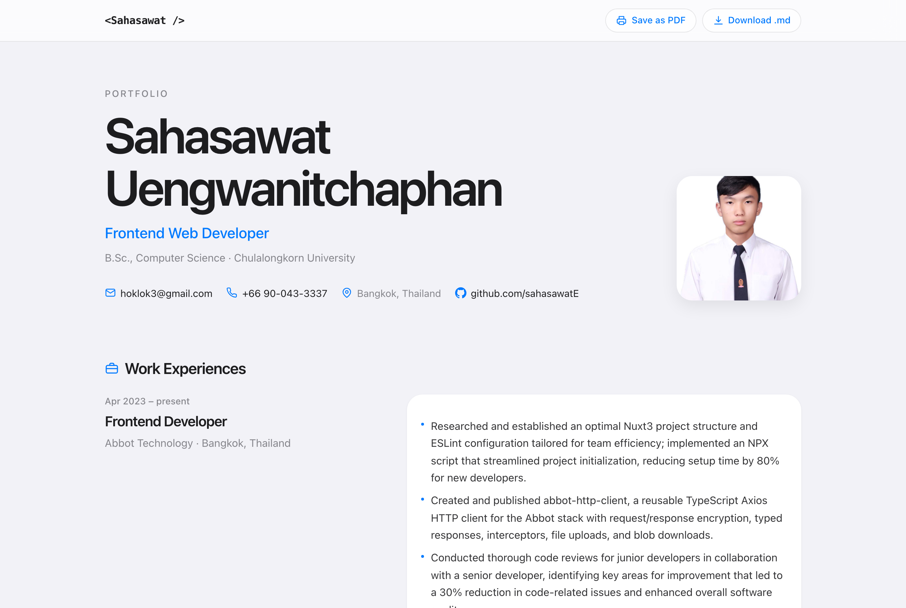
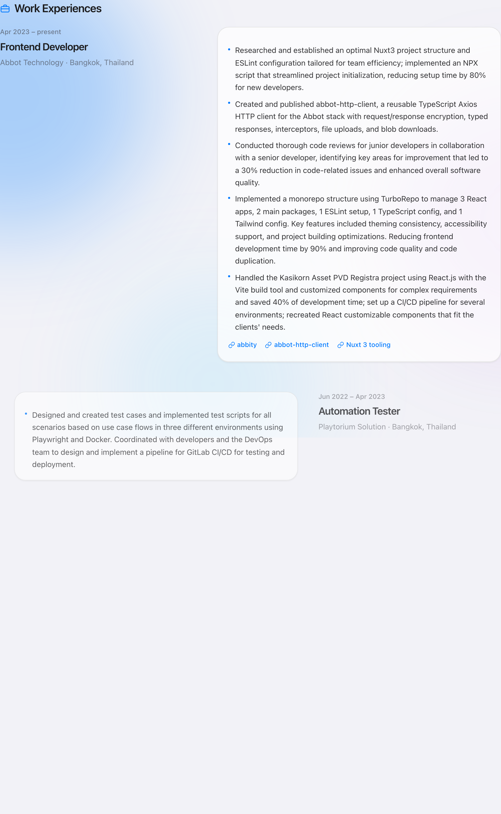
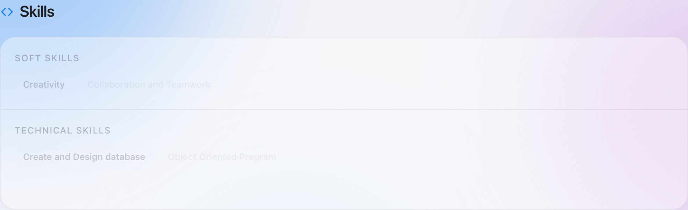

# `<Sahasawat />`

Live at [https://sahasawate.github.io/portfolio/](https://sahasawate.github.io/portfolio/).

A resume that wandered into an Apple store, tried on a frosted nav bar, and refused to leave.

Same career. Calmer clothes. Vite + React, typed, and slightly bouncy. Think iOS Settings — plus a profile photo that actually showed up this time, a couple of internship Polaroids, and buttons that spring when you poke them.



## Peek inside

One long, polite scroll. Cards rise as you meet them. Work zig-zags on desktop (a nod to an older portfolio) and stacks on a phone, because thumbs exist.

Some jobs come with receipts: Bitkub’s intern certificate, Mohpromt screens. Tap a thumbnail, get a lightbox. Very “I was there.”



Skills live in grouped pills that wander in one by one. Contact is a list with chevrons, because of course it is.



## Run it

```bash
pnpm install
pnpm dev
```

Vite will print a local URL. Open it. That’s the whole ritual.

```bash
pnpm pdf          # rebuild public/resume.pdf from src/data/resume.json
pnpm build        # pdf + production bundle in dist/
pnpm preview      # taste the production build
```

## Tweak the facts, not the font

All the words live in [`src/data/resume.json`](src/data/resume.json). Change a job, add a project, drop image paths on an `images` array. Save. The page hot-reloads like it has somewhere to be.

Want a new face? Replace `public/profile.jpg`. Extra shots go in `public/media/` and get listed on the matching experience/project.

Change the JSON and want the downloadable resume to match? Run `pnpm pdf`. `pnpm build` does that for you.

## Take it with you

The frosted bar up top has two buttons, both as extra as an Apple Pencil and just as useful:

- **Save as PDF** — a real A4 resume, generated from the JSON (not a screenshot of this page). Compact, printable, allergic to rounded cards.
- **Download .md** — Markdown from the same JSON, so job boards don’t inherit your border-radius.

## Stack, if you're nosy

Vite, React, TypeScript, Tailwind CSS v4, Framer Motion, `@react-pdf/renderer`. System fonts (SF Pro if the machine brought it). Dark mode follows the OS. Reduced motion? The springs sit this one out.
